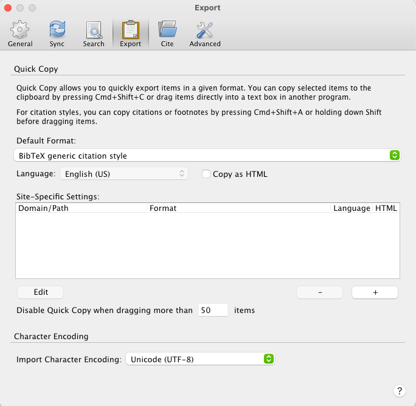

[Zotero](https://www.zotero.org/) is my favorite application for organizing, sharing, and generating bibliographies for research papers. There are many other similar reference managers such as [Mendeley](https://www.mendeley.com/download-desktop-new/) and [EndNote](https://endnote.com/) with superior features. They are either not open source or free (as in beer) or both. . 

Zotoro gets the job done for me. It has got a lot of useful features. One such function is that a citation can be exported to
clipboard so that it can be pasted into a document. This can be achieved using `⌘ + ⇧ + c` keyboard shortcut. 

You can export the citation in a variety of formats. However, if you are using `LaTeX` to write a paper, you almost always
need to paste a quote in a `BibTex` format into a `bib` file. There are a few ways of achieving this as mentioned in the [forum thread](https://forums.zotero.org/discussion/14300/copy-in-bibtex-format-how/). I found that the easiest way is to download and install the `BibTex generic citation` style from the [Zotero style repository](https://www.zotero.org/styles?q=bibtex). After installing, set the default export format to `BibTex generic citation style` as shown below.

